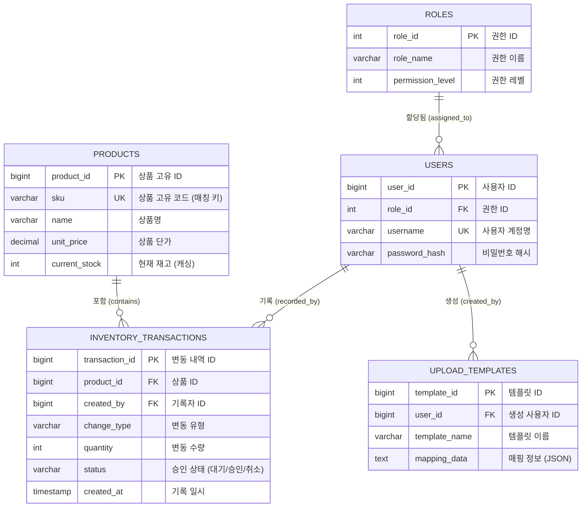

# 💾 SS 프로젝트 (StockSync) 최종 DB 스키마

## 1. Products (상품 마스터)

상품의 기본 정보와 현재 상태를 관리하는 메인 테이블입니다.

| 필드명 | 데이터 타입 | 제약 조건 | 설명 |
| :--- | :--- | :--- | :--- |
| **product\_id** | BIGINT | **PK** | 상품의 고유 ID |
| **sku** | VARCHAR(50) | **Unique, Not Null** | 상품 고유 코드 (엑셀 매칭 키) |
| name | VARCHAR(255) | Not Null | 상품명 |
| unit\_price | DECIMAL | Not Null | 상품 단가 (재고 총액 계산용) |
| safety\_stock | INT | Default 0 | 안전 재고 수량 |
| **current\_stock** | INT | Not Null | **현재 재고 수량 (캐싱 필드)** |

---

## 2. Inventory\_Transactions (재고 변동 내역)

모든 재고 증감 내역을 기록하는 **로그(Log) 테이블**이자, 승인 프로세스의 핵심입니다.

| 필드명 | 데이터 타입 | 제약 조건 | 설명 |
| :--- | :--- | :--- | :--- |
| **transaction\_id** | BIGINT | **PK** | 변동 내역의 고유 ID |
| **product\_id** | BIGINT | **FK (Products)** | 해당 상품 ID |
| **created\_by** | BIGINT | **FK (Users)** | 업로드/기록한 사용자 ID |
| change\_type | VARCHAR(20) | Not Null | 변동 유형 (IN, OUT, DEFECT, ADJUST 등) |
| quantity | INT | Not Null | 변동 수량 (+/-) |
| reference\_doc | VARCHAR(255) | Nullable | 근거 파일명 또는 주문번호 |
| **status** | VARCHAR(10) | Not Null | **승인 상태 ('대기', '승인', '취소')** |
| created\_at | TIMESTAMP | Not Null | 기록 일시 |

---

## 3. Users (사용자)

시스템을 사용하는 사용자 정보 및 권한을 관리합니다. (제3 정규화 적용)

| 필드명 | 데이터 타입 | 제약 조건 | 설명 |
| :--- | :--- | :--- | :--- |
| **user\_id** | BIGINT | **PK** | 사용자 고유 ID |
| username | VARCHAR(50) | Unique, Not Null | 사용자 계정명 |
| password\_hash | VARCHAR(255) | Not Null | 비밀번호 해시 값 (Spring Security 관리) |
| **role\_id** | INT | **FK (Roles)** | 사용자가 가진 권한 ID |

---

## 4. Roles (권한 관리)

사용자의 권한 속성을 정의하는 테이블입니다. (제3 정규화 적용)

| 필드명 | 데이터 타입 | 제약 조건 | 설명 |
| :--- | :--- | :--- | :--- |
| **role\_id** | INT | **PK** | 권한 고유 ID |
| role\_name | VARCHAR(50) | Unique, Not Null | 권한 이름 (예: ADMIN, MANAGER, UPLOADER) |
| permission\_level | INT | Nullable | 권한 레벨 (세부 권한 관리용) |

---

## 5. Upload\_Templates (업로드 템플릿)

엑셀 업로드 시 사용되는 컬럼 매핑 정보를 저장합니다.

| 필드명 | 데이터 타입 | 제약 조건 | 설명 |
| :--- | :--- | :--- | :--- |
| **template\_id** | BIGINT | **PK** | 템플릿 고유 ID |
| **user\_id** | BIGINT | **FK (Users)** | 템플릿을 생성한 사용자 |
| template\_name | VARCHAR(100) | Not Null | 템플릿 이름 |
| **mapping\_data** | JSONB/TEXT | Not Null | 엑셀 컬럼과 DB 필드의 매핑 정보 |

